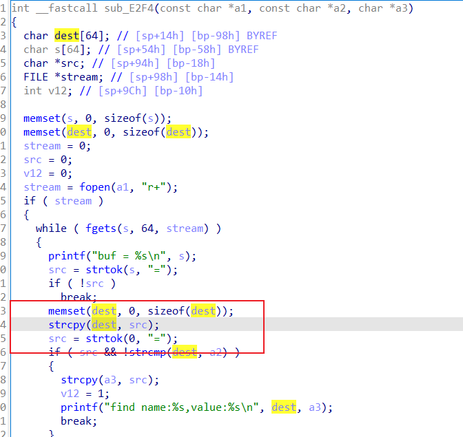

Tenda AC15 Unauthorized stack overflow vulnerability

## **1. Affected version:**

US_AC15V1.0BR_V15.03.05.19

## **2. Firmware download address**

[资料下载_腾达(Tenda)官方网站](https://www.tenda.com.cn/download/default.html)

## **3. Vulnerability details**

The function "sub_E2F4" contains a stack-based buffer overflow vulnerability. In the function, it reads in a user-provided parameter, and the variable is passed to the function without any length check, which may lead to overflow of the stack-based buffer. As a result, by requesting the page, an attacker can easily execute a denial of service attack or remote code execution with carefully crafted overflow data.

## **4. Recurring vulnerabilities and POC**

Due to legal and policy reasons, we are unable to provide the exploit for this vulnerability at this time.

## 5. Author

范启航 220579866
